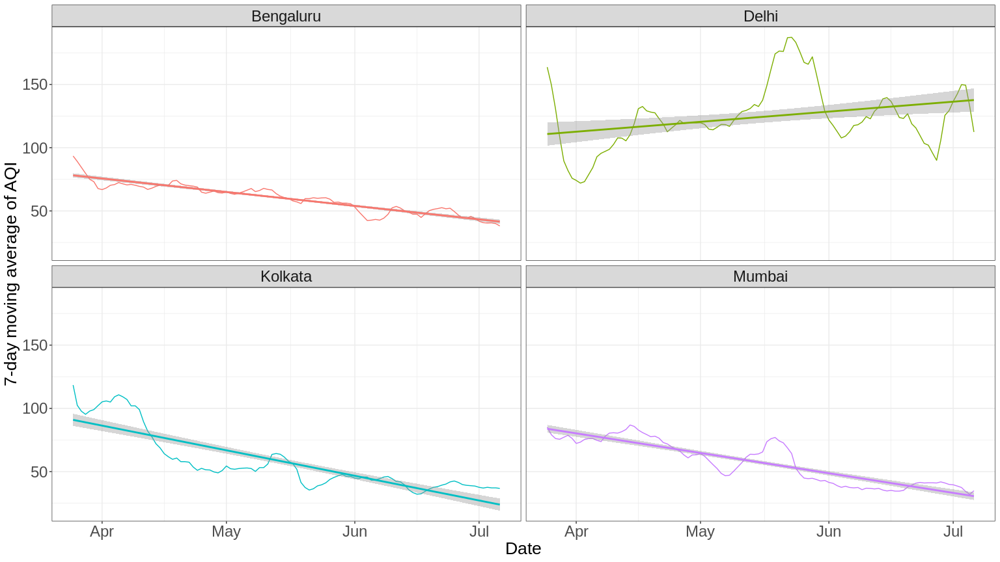
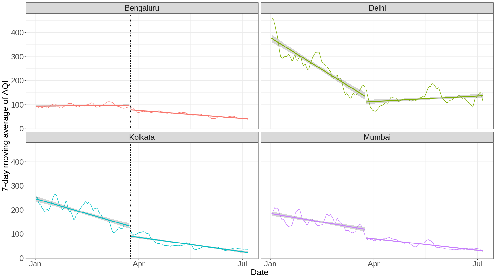
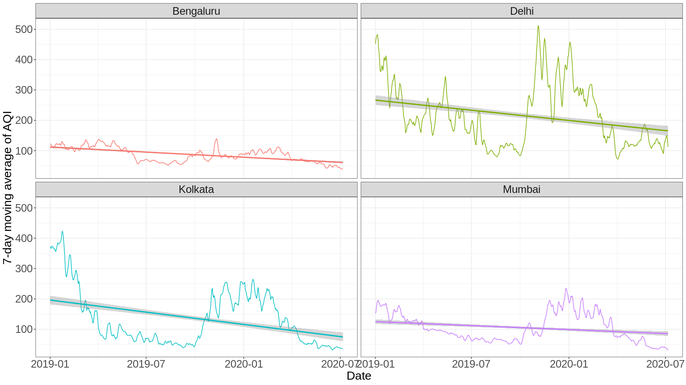
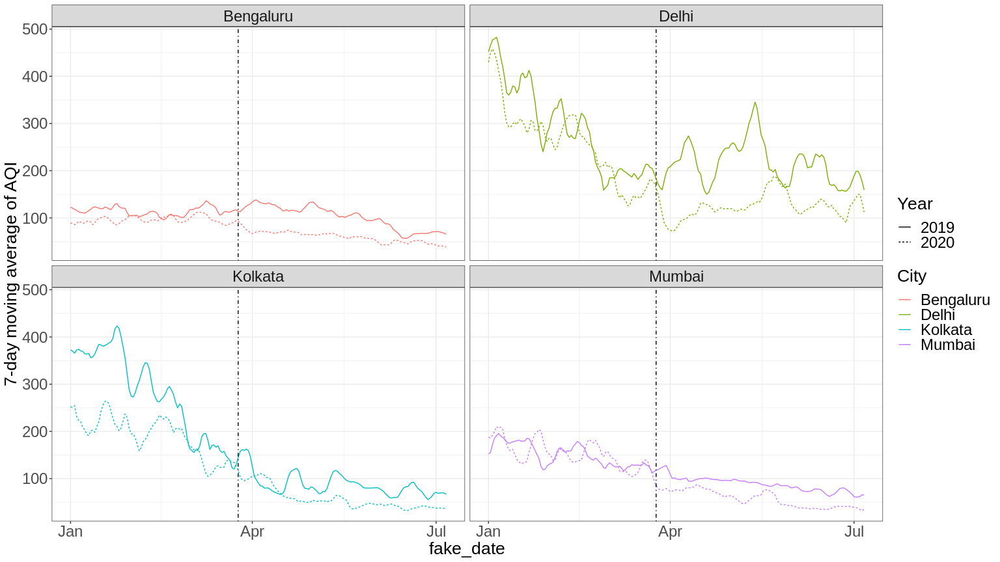
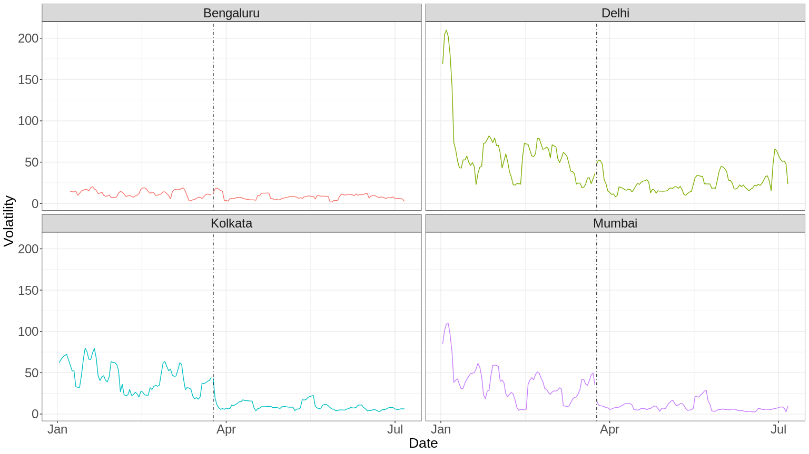
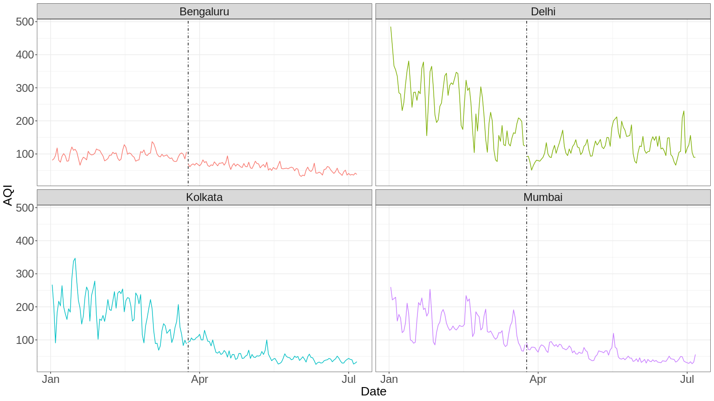

As lockdowns around the world continue to grind on, we are starting to
notice their effects on all aspects of life. One of the rare silver
linings that has emerged in popular discussion is the dramatic reduction
in air pollution that lockdowns have caused.
[Research](https://theconversation.com/wuhans-lockdown-cut-air-pollution-by-up-to-63-new-research-138084)
on the original Wuhan lockdown suggested that the resulting declines in
air pollution (63% reduction in nitrogen dioxide) may have saved up to
11,000 lives in China.

Similar analyses have been carried out in India, with headlines like
[“Air pollution dropped significantly during
lockdown”](https://indianexpress.com/article/india/drastic-fall-in-pollution-during-74-days-of-lockdown-analysis-6488906/)
and conclusions like [“India’s nationwide lockdown, in particular, has
had stunning effects on air pollution
levels.”](https://www.thehindubusinessline.com/opinion/columns/the-effect-of-covid-19-on-indias-air-quality/article31564038.ece)
But reading the language used in the Indian Express article made me
nervous:

> “Air pollution dropped significantly during 74-day lockdown period.”
> (title)

> “The clampdown on all non-essential activities due to the COVID-19
> pandemic, from March 25 to June 8, led to a significant decline in air
> pollution levels for major cities across India.” (subtitle)

The title and the subtitle are saying two different things! Just because
air pollution dropped during the lockdown doesn’t mean that the lockdown
*caused* a significant decline in air pollution levels. It’s the old
saw: correlation doesn’t mean causation. So I wanted to look into some
air quality data myself to see the story.

The Analysis
------------

I obtained air quality index (AQI) data from [this popular
dataset](https://www.kaggle.com/rohanrao/air-quality-data-in-india),
which extracts air quality data from the Central Pollution Control
Board’s data platform. It only contained AQI data until May 1st in most
cities, so I supplemented it by scraping the CPCB’s AQI bulletin
announcements every day to bring the data up to July 6th.

In particular, I used daily city-level data on four major cities: Delhi,
Mumbai, Kolkata and Bangalore. I chose these cities because they are the
biggest cities, in which industrial and economic activity are likely to
be the biggest sources of pollution - and because the Indian Express
article that prompted this investigation focuses on those cities.

The first investigative question is, how has the AQI in each city
changed since the lockdown began?

Air quality trend since March 25th.

Note that higher AQI corresponds to more air pollution. This figure
generally bears out the conclusion that air quality has increased during
the lockdown period, with the notable exception of Delhi, where air
quality has gotten *worse*. The most likely reason for this difference
from the Indian Express article’s conclusion about Delhi is because I’m
focusing on AQI, whereas the article focuses on the decline in specific
pollutants like NO2 and PM2.5. With the caveat that I am not an
environmental scientist, focusing on AQI seems to be more sound:

1.  It’s calculated in a defined way set out by the CPCB, so there’s no
    risk of a misleading conclusion from selectively looking at some
    pollutants rather than others that tell a more favorable story. I’m
    not accusing the Indian Express of trying to p-hack their analysis,
    but choosing AQI is just a more sound approach.

2.  CPCB guidelines correspond to AQI levels and give health impacts
    corresponding to each AQI level, which can be more easily applied to
    health impact analysis than aggregating impacts corresponding to
    each specific pollutant level.

So far, we’ve seen that air quality has improved during lockdown. But
when looking at my main concern - how the AQI decline post-lockdown
compares to the AQI trend pre-lockdown - the story looks a lot less
clear.

Air quality has been improving throughout 2020.

It turns out that in all four cities, AQI was on a steady decline
throughout 2020 in the pre-lockdown period. It *is* interesting to note
that there seems to be a break at the beginning of lockdown, March 25th.
But that should be taken with a grain of salt: after all, if you
generate an arbitrary date to separate periods in 2020, the lines of
best fit will often have a break. If you can’t convince yourself this is
true, I’ve created a [Shiny
app](https://karthik-tadepalli.shinyapps.io/aqi-breaks/) for you to
simulate different “lockdown” dates yourself and see the breaks that
they create.

When we rewind to 2019, it becomes clear that the decline in AQI in 2020
is part of a seasonal effect that we can see in full cyclical form in
2019.

AQI cyclicality since 2019.

It seems that air quality has a strong seasonal pattern, and focusing
only on 2020 misses that seasonal pattern. This means analyses of AQI
that take only 2020 as the pre-lockdown period are flat-out incorrect -
they are conducting a full study within a season.

The Indian Express article *does* reference data from before 2020.

> “The analysis showed that Mumbai’s PM 2.5 average during the lockdown
> was 20, while the average was 40 in 2017, 47 in 2018 and 36.1 in 2019…
> Kolkata’s average PM 2.5 during the lockdown was 22 as opposed to 69.3
> 2017, 86.2 in 2018 and 57.7 in 2019… Delhi’s PM 2.5 average during the
> lockdown was 49. It was 101.3 in 2017, 121 in 2018 and 109.2 in 2019.
> Similarly, Bangalore’s PM 2.5 average during the lockdown was 23; it
> was 46.1 in 2017, 47.4 in 2018 and 36.7 in 2019.”

Setting aside the issue of PM2.5 vs AQI as a metric, we can see from
Figure @ref(fig:seasonal) why this is a really bad comparison! We are
only in the low-pollution half of the 2020 air quality cycle, whereas
the average pollution levels of 2017, 2018 and 2019 include the
high-pollution months of October through December, so they will
obviously be higher on average. We can also see a general trend towards
better air quality (lower AQI), which doubly explains improvements in
2020 relative to previous years. Nothing so far has shown the effect of
lockdowns. The bottom line is that this comparison is misleading.

A Better Comparison - Diverging Trends
--------------------------------------

If we wanted to fix their analysis, we would make an apples-to-apples
comparison by including only January through July 6th in 2019. In order
to account for the trend towards improved air quality, we would ignore
the absolute gap between the trend lines and focus only on whether they
*diverge* after lockdown begins. If this diverges after lockdown, that
would suggest that India’s lockdown is actually impacting air quality.

How do 2019 and 2020 differ in AQI trends?

This figure tells the most promising story yet: we can see in general,
the lines diverge and grow further apart after March 25th, suggesting
that air quality in April through June of 2020 has been much better than
in April through June of 2019. Nowhere is this difference more clear
than in Delhi, which originally looked like a disaster in Figure
@ref(fig:firstplot), but now is vindicated by a comparison to Delhi in
2019… when air quality was seriously worrying.

The intuition behind Figure @ref(fig:did) - to see how the trend is
affected by comparing pre-/post-lockdown air quality - mirrors the
*difference-in-differences* analysis, beloved among economists. The
concept is simple: to study the impact of a change, you have to find a
“treatment” group (which was affected by the change) and a “control”
group (which was not). Furthermore, treatment and control have to be
aligned in the pre-period: if they diverge in the post-period, it means
the event has caused them to diverge. This can be captured in a
regression
*Y**i* = *β*1*T**r**e**a**t**e**d**i* + *β*2*P**o**s**t**i* + *β*3*T**r**e**a**t**e**d**i* \* *P**o**s**t**i*

If *β*3 is significant, then it signifies that the treatment
and control diverged significantly in the lockdown period. We can
actually estimate this to demonstrate quantitatively what Figure
@ref(fig:did) shows qualitatively.

<table style="text-align:center">
<caption>
<strong>A difference-in-differences analysis of air quality with city
fixed effects</strong>
</caption>
<tr>
<td colspan="2" style="border-bottom: 1px solid black">
</td>
</tr>
<tr>
<td style="text-align:left">
</td>
<td>
<em>Dependent variable:</em>
</td>
</tr>
<tr>
<td>
</td>
<td colspan="1" style="border-bottom: 1px solid black">
</td>
</tr>
<tr>
<td style="text-align:left">
</td>
<td>
AQI
</td>
</tr>
<tr>
<td colspan="2" style="border-bottom: 1px solid black">
</td>
</tr>
<tr>
<td style="text-align:left">
Treated
</td>
<td>
-33.401\*\*\*
</td>
</tr>
<tr>
<td style="text-align:left">
</td>
<td>
(4.541)
</td>
</tr>
<tr>
<td style="text-align:left">
</td>
<td>
</td>
</tr>
<tr>
<td style="text-align:left">
Lockdown
</td>
<td>
-81.992\*\*\*
</td>
</tr>
<tr>
<td style="text-align:left">
</td>
<td>
(4.305)
</td>
</tr>
<tr>
<td style="text-align:left">
</td>
<td>
</td>
</tr>
<tr>
<td style="text-align:left">
Treated \* Lockdown
</td>
<td>
-14.967\*\*
</td>
</tr>
<tr>
<td style="text-align:left">
</td>
<td>
(6.089)
</td>
</tr>
<tr>
<td style="text-align:left">
</td>
<td>
</td>
</tr>
<tr>
<td colspan="2" style="border-bottom: 1px solid black">
</td>
</tr>
<tr>
<td style="text-align:left">
Observations
</td>
<td>
1,496
</td>
</tr>
<tr>
<td style="text-align:left">
R2
</td>
<td>
0.873
</td>
</tr>
<tr>
<td style="text-align:left">
Adjusted R2
</td>
<td>
0.872
</td>
</tr>
<tr>
<td style="text-align:left">
Residual Std. Error
</td>
<td>
58.503 (df = 1489)
</td>
</tr>
<tr>
<td style="text-align:left">
F Statistic
</td>
<td>
1,456.504\*\*\* (df = 7; 1489)
</td>
</tr>
<tr>
<td colspan="2" style="border-bottom: 1px solid black">
</td>
</tr>
<tr>
<td style="text-align:left">
<em>Note:</em>
</td>
<td style="text-align:right">
*p&lt;0.1; **p&lt;0.05; ***p&lt;0.01
</td>
</tr>
</table>

The key assumption behind this estimation strategy is the “parallel
trends assumption”; that 2019 emissions and 2020 emissions would have
evolved in parallel in the absence of COVID lockdowns. This is
unverifiable, because it is about a purely hypothetical scenario.
However, we can feel more confident about this assumption if the
pre-trends—the emissions trends for 2019 and 2020 before March 25—are
parallel. Figure @ref(fig:did) shows that this is noisy, but seems to
hold, except for Kolkata where 2020 pre-COVID emissions were much
flatter than 2019 emissions for the same months.

In short, we can see that the conclusion reached by news articles is
accurate, but their reasoning was quite wrong. Lockdowns have plausibly
reduced air pollution, but this cannot be concluded just from observing
that air pollution is lower than it was before lockdowns, or in 2020 as
a whole.

Volatility, and a Conjecture
----------------------------

One more thing is interesting to note. I used the 7-day moving average
of AQI as a measure because AQI is extremely noisy on a day-to-day
basis, which makes it very hard to see trends. But it turns out this
volatility has also changed under lockdown.

AQI has become much less volatile during lockdown.

It seems that the biggest change in air quality during India’s lockdown
has been in its volatility! As you can see, I define volatility as the
standard deviation of the past 7 days’ AQI. Volatility has dropped
almost to zero since lockdown began. This is also made clear by looking
at AQI itself, rather than the smoothed-out moving average.

AQI becomes relatively steady post-lockdown.

The near-disappearance of AQI volatility makes me conjecture that one of
the biggest effects of India’s lockdown has been to reduce the
cyclicality of economic activity. Rather than booms and busts in
driving, factory production, etc, we have entered a new equilibrium: if
it is essential, it happens, and if it is non-essential, it doesn’t
happen. This pattern of activity can change, but not extremely fast:
people and businesses are being very deliberative about what economic
activity to pursue. In short, it seems that India’s lockdown has driven
economic activity to a near-steady state.

This is perfectly compatible with the lockdown also *reducing* economic
activity in aggregate, of course. But I think it points to effects
beyond the aggregate activity level that are underappreciated right now,
but could be really influential in the long run. I see people around me
forming habits: habits of routinizing shopping rather than making
impulse purchases, of travelling only if travel is necessary. I don’t
know how durable this behavior change will be - it’s certainly possible
that when COVID is behind us, people will go back to behaving like they
used to. But it’s interesting to think about what might be.
